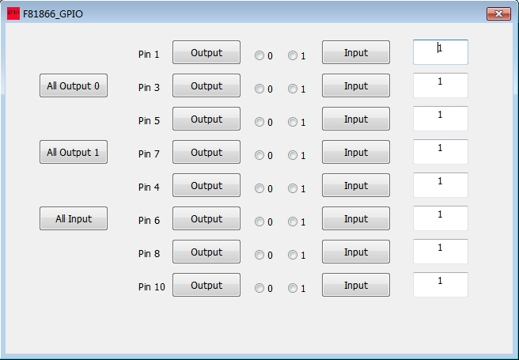
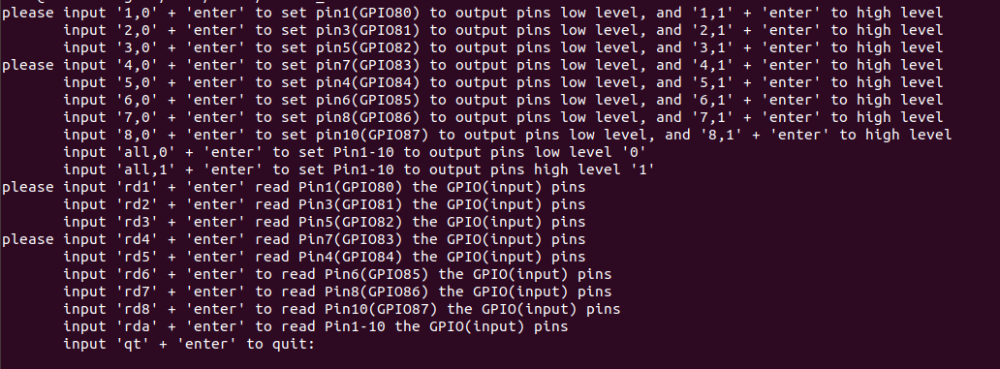

# GPIO 控制软件说明

# 介绍

本项目的GPIO 软件是控制 F81866 和 F81804  芯片的。

Window 版是通过 VS2015 与 WinRing0 构建，使用 WinRing0 库的 WriteIoPortByte 和 ReadIoPortByte 函数来进行控制

Linux 版是 通过 \#include <sys/io.h> 头文件,使用 outb 和  inb 函数来进行控制。


## 示例：F81866_GPIO

### Window 版（控制 GPIO80 ~GPIO87）



​	使用步骤：

- 1、点击 Output 按钮，将 GPIO状态转变为 ‘输出状态’ ，再点击单选按钮 0 /1 ，将GPIO的值改变为 0 / 1
- 2、点击 Input 按钮， 将 GPIO状态转变为 ‘输入状态’ 
- 3、在最右边的 编辑框中，显示 GPIO对应的值
- 4、点击 ' All Output 0 ',' All Output 1' 分别将 对应的所有GPIO 调节为 ’输出模式‘ 0和1
- 5、点击 'All Input '将 对应的所有GPIO 调节为 ’输入模式‘

### Linux 版  （控制 GPIO80 ~GPIO87）

 ```shell
sudo apt-get install gcc (ubuntu) 	[Centos](yum install gcc)
gcc -o F81866_GPIO F81866_GPIO.c
su (以 root 身份运行)
./F81866_GPIO
 ```



根据提示控制 GPIO。

例如 控制 GPIO 80 即 Pin1，

- 在程序中输入 1,0 （控制GPIO 1脚 转换为输出模式，值为0） 

- 在程序中输入 1,1 （控制GPIO 1脚 转换为输出模式，值为1） 

- 在程序中输入 rd1（控制GPIO 1脚 转换为输入模式） 
